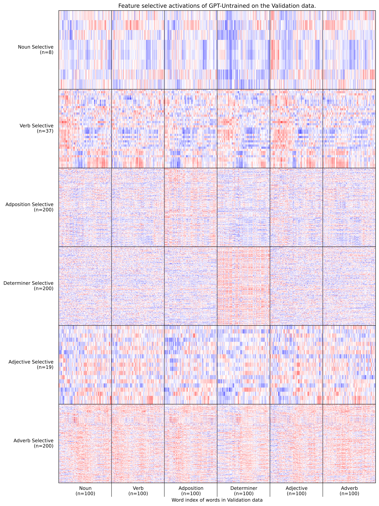

# The Hidden Knowledge of Untrained Neural Language Models (Ben Ware, 2024)

This page includes instructions for reproducing results from the paper
[The Hidden Knowledge of Untrained Neural Language Models (Ben Ware, 2024)](https://esploro.libs.uga.edu/esploro/outputs/9949644724302959)

[TOC]

## Requirements and Installation:

See [installation instructions](install_environments/README.md). 

## Running
Notebooks can either be run interactively in JupyterLab:
```bash
cd ./jupyterlab
jupyter lab
```
or be converted into standalone scripts and executed with nbconvert:
```bash
jupyter nbconvert --inplace  --ExecutePreprocessor.kernel_name=untrained_prior --execute ./jupyterlab/01_Corpus_preprocessing.ipynb
```

### Preprocessing
1. Download and preprocess the HuggingFace implementation of (the OntoNotes corpus)[https://huggingface.co/datasets/ontonotes/conll2012_ontonotesv5]:
```bash
jupyter nbconvert --inplace  --ExecutePreprocessor.kernel_name=untrained_prior --execute ./jupyterlab/01_Corpus_preprocessing.ipynb
```

2. Download pretrained models and generate random initializations:
```bash
# load script functions into shell (activates 'neural_nlp_custom' environment)
source ~/untrained_prior/neural-nlp-scripts.sh

# Activate neural_nlp_custom environment
conda activate neural_nlp_custom

# saves models in ~/data/
create_model gpt2-xl gpt2-xl
create_model gpt2-xl-untrained_1 gpt2-xl-untrained
create_model gpt2 gpt2
for i in $(seq 1 9); do 
    create_model gpt2-untrained_$i gpt2-untrained
done
```

3. Generate new gaussian randomization of the 12 weights in the first transformer block.
```bash
python3 ./scripts/E0_1_gen_weight_configs.py
```

4. Score these models on the fMRI benchmarks.
```bash
# load scripts into shell (uses 'neural_nlp_custom' conda environment)
source ~/untrained_prior/neural-nlp-scripts.sh

 # score models on benchmarks 
for encoding in Blank2014fROI-encoding Pereira2018-encoding; do
    score_model $encoding gpt2-xl{,,}
    score_model $encoding gpt2-xl-untrained{_1,,_1}
    score_model $encoding gpt2{,,}
    for i in $(seq 1 9); do 
        score_model $encoding gpt2-untrained{_$i,,_$i}
        score_model $encoding gpt2-untrained{_${i}_weight_config_all,,_$i,_weight_config_all}
    done
done
```

5. Extract model activations for the first 5000 words of the OntoNotes corpus.
```bash
# Load scripts into shell (uses 'neural_nlp_custom' conda environment)
source ~/untrained_prior/scripts/neural-nlp-scripts.sh

# Extract model activations over OntoNotes corpus
get_activations gpt2-xl{,,}
get_activations gpt2-xl-untrained{_1,,_1}
get_activations gpt2
for i in $(seq 1 9); do 
    get_activations gpt2-untrained{_$i,,_$i}
    get_activations gpt2-untrained{_${i}_weight_config_all,,_$i,_weight_config_all}
done

# Deactivate neural_nlp_custom environment
conda deactivate
```

6. Run the Experiments.
```bash
jupyter nbconvert --inplace  --ExecutePreprocessor.kernel_name=untrained_prior --execute ./jupyterlab/04_Exp1.ipynb
jupyter nbconvert --inplace  --ExecutePreprocessor.kernel_name=untrained_prior --execute ./jupyterlab/06_Exp2.ipynb
```

7. Running the rest of the notebooks to generate the figures and tables used for publication.
```bash
jupyter nbconvert --inplace  --ExecutePreprocessor.kernel_name=untrained_prior --execute ./jupyterlab/02_Corpus_tbl_stats.ipynb
jupyter nbconvert --inplace  --ExecutePreprocessor.kernel_name=untrained_prior --execute ./jupyterlab/03_Brainscore_figs.ipynb
jupyter nbconvert --inplace  --ExecutePreprocessor.kernel_name=untrained_prior --execute ./jupyterlab/05_Exp1_figs.ipynb
jupyter nbconvert --inplace  --ExecutePreprocessor.kernel_name=untrained_prior --execute ./jupyterlab/07_Exp2_figs_model_activations.ipynb
jupyter nbconvert --inplace  --ExecutePreprocessor.kernel_name=untrained_prior --execute ./jupyterlab/08_Exp2_tbl_count_selective_neurons.ipynb
jupyter nbconvert --inplace  --ExecutePreprocessor.kernel_name=untrained_prior --execute ./jupyterlab/09_Exp2_fig_POS6_frequencies.ipynb
jupyter nbconvert --inplace  --ExecutePreprocessor.kernel_name=untrained_prior --execute ./jupyterlab/10_Exp2_figs_pmax_distrubution.ipynb
jupyter nbconvert --inplace  --ExecutePreprocessor.kernel_name=untrained_prior --execute ./jupyterlab/11_Exp2_tbl_count_selective_neurons_per_model.ipynb
```

### Examples
(Brainscore) How well can the models predict fMRI data?

As previously reported, the untrained models are able to predict the data surprisingly well

(Experiment 1) How predictable are the previous, current, and next words in the sentence from the current word's activations?  


(Experiment 1) How predictable are various categorical word features for the previous, current, and next words in the sentence from the current word's activations?

- Tree depth is the depth in the syntactic tree, as parsed in the corpus.
- Word order is the depth in the sentence string (I.e the word order of the first word of each sentence is 1, the word order of the second is 2...)
- POS-51 is the original 51 category POS (part of speech) tags as tagged in the corpus.
- POS-12 is a 12 category tagset derived from simplifying POS-51.
- POS-7 is, likewise, a 7 category tagset derived from simplifying POS-12.
- Function vs Content is a binary category:
    - Content words are the words that contain the real world content in the sentence. (Eg., car, running, green, slowly)
    - Function words are words that serve to organize language and relate content words. (Eg. a, the, and, for, but, yet, on, it)

(Experiment 2) Trained model activations: The activations of 200 neurons selective for each of the 6 most common POS categories, on validation words.

As previously reported, the models clearly have neurons that select for specific categories. (Please see [this](https://openai.com/index/language-models-can-explain-neurons-in-language-models/) for a fascinating related read.)

(Experiment 2) Untrained model activations: The activations of 200 neurons selective for each of the 6 most common POS categories, on validation words.

Here, the untrained models seem to be performing around chance for categories other than determiners and adpositions. Further analysis show that it might be that the neurons are simply selective for common words, rather than yielding information about how words in a sentence relate:

This figure shows the prevalence of the 15 most common words from each of the 6 POS categories.  Note that "the" accounts for approximately half of all determiners and "of" for approximately a quarter of adpositions.

## Full Data Release

Download all data used in the project from [Google drive](https://github.com/facebookresearch/mlqe).

Data includes all files produced from this code pre-trianed models, model parameters, model activations, pre-processed corpus data, word features, and results. (~61 GB)


## License

untrained_prior is released under the [MIT license](LICENSE)..
 
## Citation

Please cite as:

``` bibtex
@masterthesis{Ware2023,
    title = {The Hidden Knowledge of Untrained Neural Language Models},
    author = {Ware, Benjamin J},
    keywords = {Deep Neural Networks;fMRI;Language Models;Linguistics;Machine Learning;NLP;Computer science},
    school = {University of Georgia},
    year = {2023},
    url = {https://esploro.libs.uga.edu/esploro/outputs/9949644724302959}
}
```